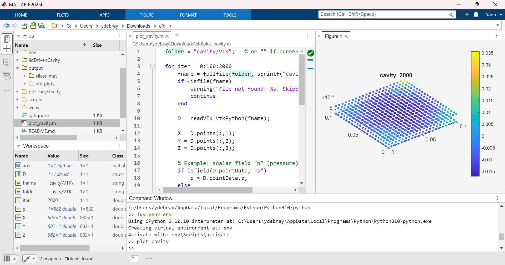

# CFD

## lid driven cavity in pure MATLAB


This repository contains a pure MATLAB implementation of the lid-driven cavity problem using the finite difference method. The code solves the incompressible Navier-Stokes equations in a square cavity with a moving lid.

## lid driven cavity in OpenFOAM

https://hub.docker.com/r/openfoam/openfoam11-paraview510

```
docker pull openfoam/openfoam11-paraview510
docker run -it -v C:\Users\ydebray\Downloads\cfd:/home/openfoam/cfd openfoam/openfoam11-paraview510 bash
```
```
mkdir -p $FOAM_RUN
```

```
cd $FOAM_RUN
cp -r $FOAM_TUTORIALS/incompressibleFluid/cavity .
cd cavity
blockMesh
foamRun
```

```
foamToVTK
```

